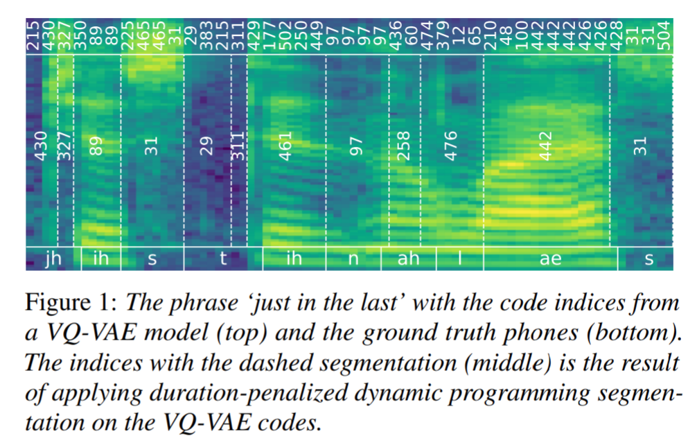

# Self Supervised VQ Phoneme Segmentation
A simple implementation of the dynamic-programming-based phoneme segmentation method given in [Towards unsupervised phone and word segmentation using self-supervised vector-quantized neural networks](https://arxiv.org/abs/2012.07551) (INTERSPEECH 2021)

## Notice
The accuracy of the method is heavily dependent on the parameter lambda, which varies greatly between choice of self-supervised representation. 
**Lambda is set to 35 in default.**
Values between 20~50 work decently well for the 6th layer of HuBERT.

## Visualization with Praat
Given an audio file and its text transcript, we can use forced alignment to obtain supervised word/phoneme boundaries, to visualize our method's accuracy.
Detailed steps are given in `demo.ipynb`.

## Dependencies
- The [S3PRL toolkit](https://github.com/s3prl/s3prl)
- Pretrained K-means model (see [FAIRSEQ GSLM](https://github.com/pytorch/fairseq/tree/main/examples/textless_nlp/gslm/speech2unit))

## TODO:

- [x] Add forced alignment and Praat visualization demo
- [ ] Add F1 score calculation
